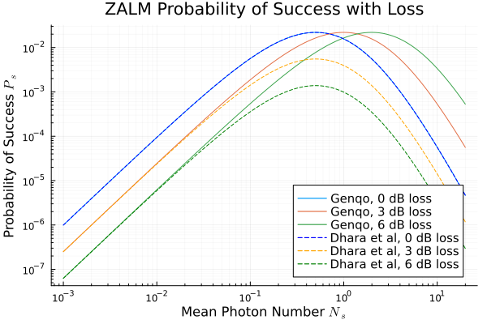

# Genqo.jl: A Hybrid Gaussian/non-Gaussian Quantum Optics Modeling Engine

[](https://QuantumSavory.github.io/Genqo.jl/stable/)
[](https://QuantumSavory.github.io/Genqo.jl/dev/)
[](https://github.com/QuantumSavory/Genqo.jl/actions/workflows/ci.yml?query=branch%3Amain)
[](https://codecov.io/gh/QuantumSavory/Genqo.jl)
[](https://doi.org/10.5281/zenodo.18870771)

**Contents**
- [Why Genqo?](#why-genqo)
- [Installation](#installation)
- [Quickstart](#quickstart)

## Why Genqo?

Genqo.jl is a package for efficiently modeling hybrid Gaussian / non-Gaussian CV quantum optics. It is useful for problems such as modeling entangled photon sources, general GBS-based multimode state preparation, and photonic quantum computing.

Genqo provides an interface for working with non-Gaussian projections of Gaussian states in a computationally efficient manner. When a Gaussian state is projected onto a specific measurement outcome, an intermediate object is created that looks and feels like a density matrix. Methods on this intermediate type implement a closed form involving a matrix Hafnian, which is handed off to [TheEggman.jl](https://github.com/QuantumSavory/TheEggman.jl) for fast evaluation. This approach sidesteps any computations involving truncated infinite-dimensional density operators, which are slow, memory-intensive, and inexact. 

<div align="center">



*Comparison of the hybrid ZALM model to analytical models using the low mean photon number approximation. Divergence of hybrid model from truncated models is evident after Ns = 0.2.*

</div>

## Installation

Simply install Genqo.jl using Pkg:
```julia
using Pkg
Pkg.add("Genqo")
```

## Quickstart

Try running the [ZALM tutorial notebook](docs/tutorial/zalm2.jl) for an introduction to Genqo.jl's structure and functionality.

## Contact

Please reach out at jgunnell@umd.edu with any questions, collaborations, or ideas.
